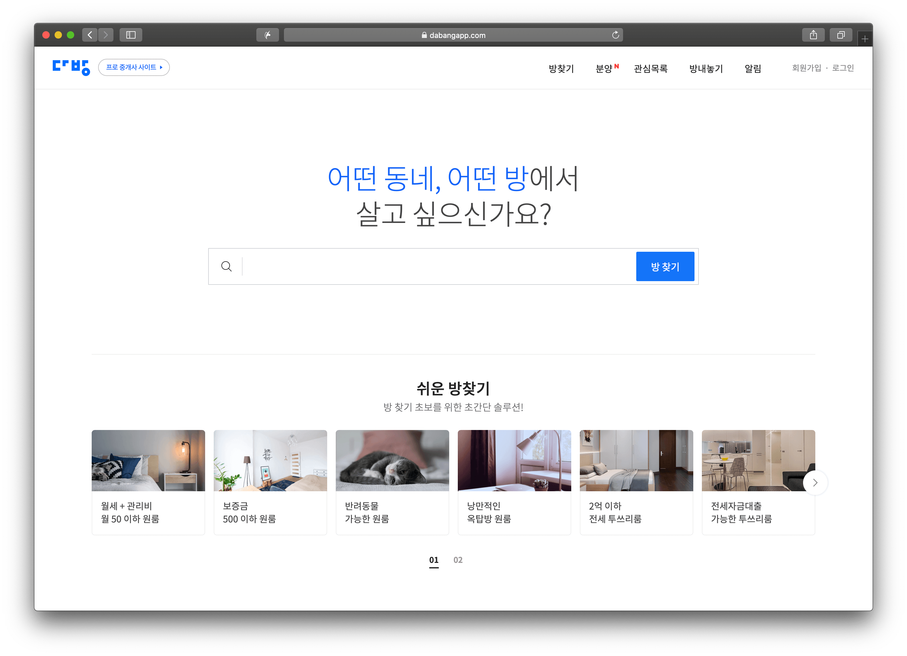

# 소개

### 이상훈 

- email: zeze.lsh@gmail.com

# 경력

### 스테이션 3

- 재직기간 : 2016.08 ~ 
- 담당업무 : 부동산 중개 플랫폼 '다방'과 '다방프로' 웹 개발

# 프로젝트

### 다방 웹

오픈형 부동산 플랫폼으로 원하는 조건의 방을 찾을 수 있는 서비스를 제공

주소: [https://dabangapp.com](https://dabangapp.com)

소속 : 스테이션3

기간 : 2017.06 ~

사용기술 : react, webpack, daum map, styled-components, redux

상세 : 
  - BI 변경 (2019.01)
  - 웹, 모바일웹 리뉴얼 (2018.10)
    - UI 변경
    - 필터 변경 및 추가
    - 분양페이지 추가
    - 구글지도 -> 다음지도 변경
    - 매물등록 변경 (다방프로와 일치)
    - react, webpack 버전 변경
  - 그외 이슈 수정

  

### 다방프로 앱 웹뷰

다방과 연계되는 공인중개사 전용 매물 관리 서비스 제공

주소
- [GooglePlay](https://play.google.com/store/apps/details?id=kr.co.station3.dabang)
- [AppStore](https://itunes.apple.com/kr/app/id1215588806)

소속 : 스테이션3

기간 : 2016.08 ~

사용기술 : react, webpack, daum map, less, styled-components

상세 : 
  - 확인매물추가 (2018.08)
  - 매물등록 매매추가 (2017.07)
  - 다방프로앱 오픈 (2017.01)

  

### 다방프로 웹

다방과 연계되는 공인중개사 전용 매물 관리 서비스 제공

주소: [https://pro.dabangapp.com](https://pro.dabangapp.com)

소속 : 스테이션3

기간 : 2016.08 ~

사용기술 : react, webpack, daum map, less, styled-components, redux

상세 : 
  - BI 변경
  - 확인매물추가, 본인인증추가 (2018.08)
  - 상품변경 (2018.04)
    - 일반상품, 동상품, 지하철상품, 캠퍼스상품 -> 일반상품(원/투/쓰리룸, 오피스텔, 아파트), 단지상품(오피스텔, 아파트), 프리미엄(동, 지하철, 캠퍼스)
  - 리팩토링 (2018.03)
     - react v15 -> v16 변경
     - react-dom v15 -> v16 변경
     - react-addons-update -> immutability-helper 변경
     - styled-components v2 -> v3 변경
     - 모달 변경 render, unmountComponentAtNode -> createPortal
  - 매물등록 -> 아파트 매매 추가 (2017.07)
  - 정기결제 서비스 추가 (2017.06)
  - 단지 매물등록 추가 [오피스텔, 아파트] (2017.05)
  - 강제약관동의 추가 (2017.03)
  - 리팩토링 (2017.01)
    - babel v5 -> v6 변경
    - react v13 -> v15 변경
    - react-router v1.0.2 -> v3 변경
    - gulp -> webpack 변경
    - es2015, es2016 추가
    - 코드 es5 -> es6 변경
  - 캠퍼스 상품 추가 (2016.11)
  - 매물등록 -> 다방페이 추가 (2016.11)
  - 다방프로 리뉴얼 (2016.10)
  - 다방소개 페이지 추가